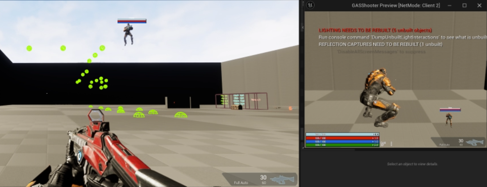

# Networked Physical Custom Movement

This project aims to facilitate the creation of physical movements for multiplayer games while integrating with the `Gameplay Ability System (GAS)`. The main goal is to separate the movement logic from the `Character Movement Component (CMC)` so programmers can focus on the movement mechanics themselves rather than network code while maintaining the server-authoritative model. We tried to achieve this by extending the `CMC` and leveraging its network pipeline.

The project is designed to be added as a plugin, which can be integrated into any game that uses the `CMC`. While `GAS` assists with triggering movements, it is also intended to work with non-GAS projects. [GASShooter](https://github.com/tranek/GASShooter) was used as a base project since it contains all the necessary game functionalities.

In this example, you will find the following movements:

* *Jump:* A launch force applied for a brief moment.
* *Jet pack:* A constant force applied over time.
* *Sprint:* Running at a higher speed.
* *Move to points:* Moving through each point generated from a spline or similar path.
* *Non-Deterministic movement:* Still a work in progress (well all of this is). The idea is to have movements that can be non-deterministic, meaning the internal movement state on the server and client can be different at a given time.

| Keybind             | Action                                                      |
| ------------------- | ----------------------------------------------------------- |
| T                   | Toggles between first and third person.                     |
| Left Mouse Button   | Activates the weapon's primary ability. Confirms targeting. |
| Middle Mouse Button | Activates the weapon's alternate ability.                   |
| Right Mouse Button  | Activates the weapon's secondary ability.                   |
| Mouse Wheel Up      | Swaps to next weapon in inventory.                          |
| Mouse Wheel Down    | Swaps to previous weapon in inventory.                      |
| R                   | Reloads the weapon.                                         |
| Left Ctrl           | Cancels targeting.                                          |
| Left Shift          | Sprint.                                                     |
| E                   | Interact with interactable objects.                         |
| Spacebar            | Jump.                                                       |
| F                   | Jetpack.                                                    |
| Q                   | Follow spline points.                                       |
| C                   | Randomly inverts movement direction every 5 seconds.        |

## Disclaimer

This is an abandoned working in progress since `Root Motion Sources` does this in a much more seamless and integrated manner, also `Mover 2.0` is already available. Use it at your own risk.
